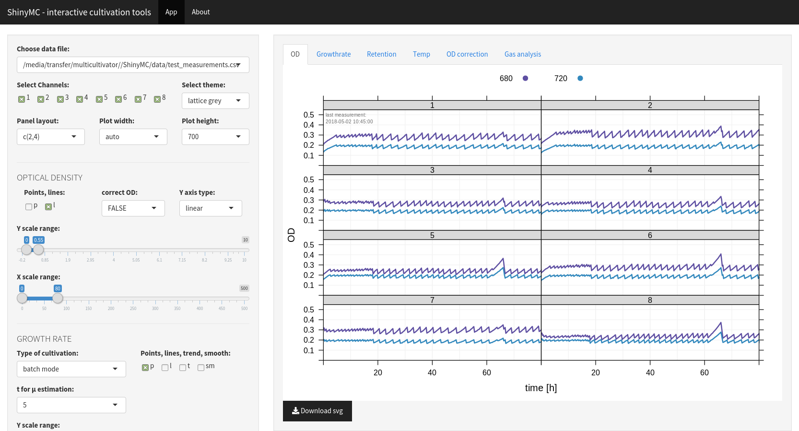

# ShinyMC

R Shiny based interface for monitoring bioreactors

Available on Shinyapps.io!
https://m-jahn.shinyapps.io/ShinyMC/

### R Shiny based interface for monitoring bioreactors

ShinyMC is an app for monitoring bioreactor experiments. Its purpose is to keep track of ongoing cultivations in MC-1000-OD bioreactors from Photon System Intruments (PSI, CZ). Other sensors can be connected to ShinyMC as well via import of text-based measurement files. Currently, ShinyMC supports the following features:

- Display of optical density (OD at 680 and 720 nm wavelength)
- Display of growth rate calculated from OD, based on either interval growth rates (batch and continuous cultivation) or frequency of dilutions (continuous)
- Display of temperature, light intensity, and other sensor measurements such as offgas
- All charts are interactive R Shiny modules and can be adjusted by sliders, check boxes and many other parameters

### Structure

ShinyMC consists of a set of R scripts that determine the functionality.

- app.R contains the main body of functions. It is devided into a GUI and a server part. The GUI contains the interactive modules such as sliders and check boxes. The server obtains input parameters from the GUI and adjusts the graphical output accordingly (changes the charts on the fly)
- readSQLite.R reads the SQLite database, formats the data, renames bioreactor channels and writes a csv file that can be imported by other platforms such as spreadsheet applications
- intervalMu.R contains functions to calculate the growth rate from the interval between two successive dilutions. It finds local minima and maxima and fits a linear equation to the data, whose slope is the specific growth rate µ

### Input data

- ShinyMC uses *.csv tables that are imported as data.frames. Valid databases are named according to the scheme 'YYYYMMDD_MCX_measurements.csv'
- It also imports gas sensor measurements named matching the pattern '_gas.txt'

### Getting started

To start ShinyMC, you need to have R (optionally also Rstudio) and some of its libraries installed, mainly:

- shiny
- shinythemes
- lattice
- latticeExtra
- tidyr
- plyr
- (RSQLite)

Open app.R in RStudio and push the 'Run App' button

*OR*

for Linux users, double click the 'ShinyMC' launcher in the /ShinyMC folder (adjust path if necessary).

*OR*

test the app on https://m-jahn.shinyapps.io/ShinyMC/
